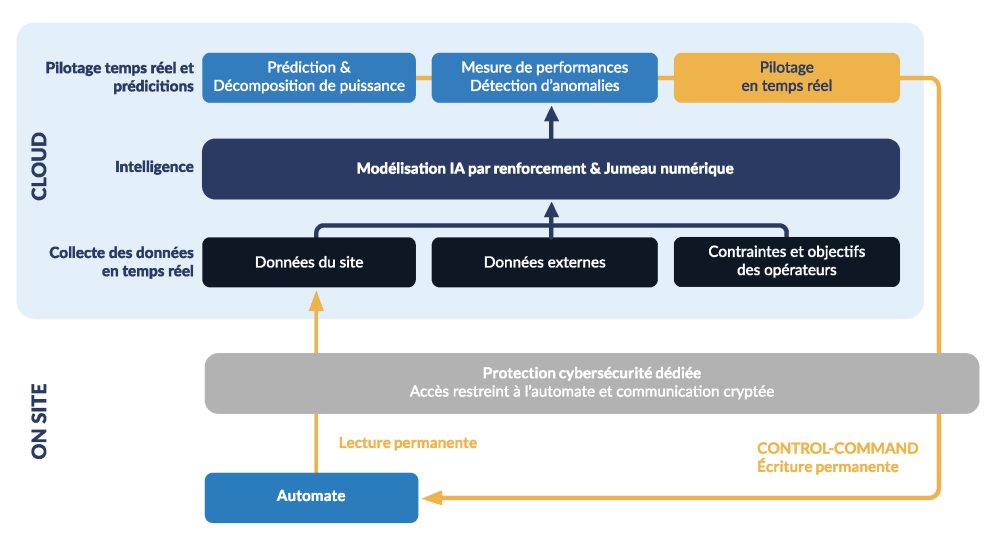
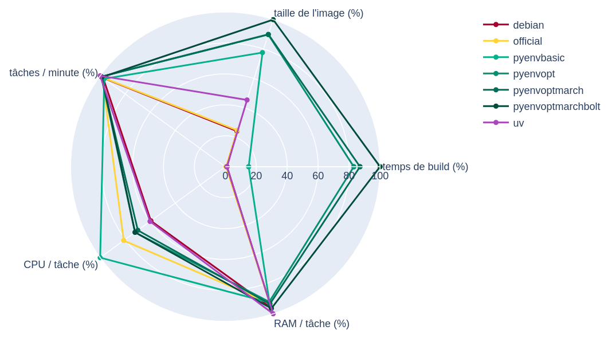

<!-- _paginate: skip -->


<!-- _class: lead -->
# Conteneurisation de Python
Chute de performances et investigations

<!--
_footer: "Sébastien Baguet, Gaston Gary, Luc Sorel-Giffo - BreizhCamp - 27 juin 2025"
 -->

<script type="module">
  import mermaid from 'https://cdn.jsdelivr.net/npm/mermaid@10/dist/mermaid.esm.min.mjs';
  mermaid.initialize({ startOnLoad: true });
</script>

---

<!-- paginate: true -->

## Qui sommes-nous ?

* Sébastien Baguet : infra lead et devOps [@Purecontrol](https://www.purecontrol.com/)
* Gaston Gary : dev [@Purecontrol](https://www.purecontrol.com/)
* Luc Sorel-Giffo : lead dev [@See you sun](https://seeyousun.fr/)
  - ex-Purecontrol 🫶
  - co-animation [Python Rennes](https://www.meetup.com/fr-FR/python-rennes/) 🔔
  - [@lucsorelgiffo@floss.social](https://floss.social/@lucsorelgiffo)

---
### Purecontrol



<!-- Purecontrol est une société Rennaise, qui propose une solution de contrôle-commande basée sur l’intelligence artificielle ; On pilote en temps réel les procédés industriels liés à l’eau et à l’énergie pour réduire simultanément la consommation, les coûts d’exploitation et les émissions de CO₂. -->

---

## Applicatif métier local-processing

(titre alternatif : Une antiquité bien dynamique)

- traitement et agrégation de **séries temporelles**
- données synthétiques utilisées par d'autres briques métier
- **50 000+ tâches par minute**
- en temps réel
- impératif : **ne pas accumuler de retard**

---
## Applicatif métier local-processing


- thread de collecte des traitements (requête MariaDB)
- pool de sous-process pour paralléliser les calculs
- chaque sous process collecte les données temporelles (requêtes InfluxDB), fait les calculs et enregistre les agrégations (InfluxDB)
- enregistrement du statut des calculs (MariaDB)


<!--
-> parallélisme +++, IO réseau ++, CPU + (traitement des données) -->
---

### Déploiement old school

- interpréteur python de la VM
- git pull (à la main en SSH)
- installation des dépendances sans **.venv/**
- redémarrage 🤞


---

### Conteneurisation Docker

```dockerfile
ARG PYTHON_VERSION
FROM python:{PYTHON_VERSION}-slim
# installation des dépendances
# copie des sources
# lancement de l'application
...
```

Avantages classiques d'une image :
- isolation et maitrise du binaire python + dépendances + code source
- exécution iso dev / tests / prod
- déploiement : rapide, automatisable, serein

On en profite pour passer de 3.8 à 3.12 😁

---

### Oui mais... perte de performance de 30% !


- **diminution** du nombre de tâches calculées chaque minute de **30%**
- accumulation rapide de **retard**
- optimisation dégradée des pilotages

---

### 🤔 Est-ce l'effet de :

- la conteneurisation et l'allocation de ressources (CPU / RAM, overhead réseau) ?
* la dockerisation (comportement des binaires) ?
* la montée de version de Python ?

---

## Quels sont les points d'optimisation d'un service numérique (Python) ?

(Luc : j'enlèverais bien les 3 puces pour laisser la salle répondre - on peut avoir des bonnes surprises - et garder le suspense sur l'optimisation du runtime)

- algorithmie
- architecture
- optimisation du runtime

---

### Profilage

- Cprofile + kcachegrind
- pyinstrument
- py-spy
- voir [Fantastic bits and where to find them : benchmark et profilage - Michel Caradec](https://www.youtube.com/watch?v=eY5k9GcHRVM) (Python Rennes, 5 décembre 2024)

Dans notre cas, la perte de performance était diluée dans tout le code 😕

<!-- Utiliser un profiler comme `kcachegrind` sur les résultats de Cprofile.

Pour visualiser :

- Fonctions les plus coûteuses
- Appels imbriqués
- Consommation CPU par bloc de code

En comparant avant et après, cela pourrait permettre d'identifier un endroit ou l'on passe plus de temps, responsable d'une perte de performance.

```python
python -m cProfile -o prof.out my_app.py && pyprof2calltree -i prof.out -o callgrind.out && kcachegrind callgrind.out
``` -->

---

### Algorithmie - 1

```python
cursor.execute(t"SELECT * FROM tasks LIMIT 100")
tasks = []
for record in cursor: # allers-retours entre l'interprétation et l'exécution
  tasks.append(Task.from_db_record(record))
execute_tasks(tasks)
```

```python
tasks = [
  Task.from_db_record(record)
  for record in cursor
] # le corps de la compréhension est exécuté "d'un coup"
```

```python
execute_tasks(
  Task.from_db_record(record) for record in cursor
) # générateur streamant les tâches
```

---

### Algorithmie - 2

- Python est un langage interprété 🐌
* facilite l'encapsulation de binaires pour les traitements CPU ⚡
  - numpy, pandas, polars
  - Tensorflow, pytorch, jax

---

### Architecture

- multithreading ou asyncio pour paralléliser les opérations IO
  * ⚠️ au `global interpreter lock`
  * désactivable dans la 3.14
* multiprocessing pour les opérations CPU
* tenir compte des coûts de création des IO (connexions bdd, threads, process) : utiliser des pools

---

### Optimisation de l'exécution - 1

```python
def transfer_money(amount: float, account):
  """ Adds a positive amount of money to the given account """
  assert is_a_valid_amount(amount)
  account.add(amount)
```

`python -O mon_script.py` supprime (voir la doc [cmdoption-O](https://docs.python.org/3/using/cmdline.html#cmdoption-O)) :
  - `-O` : les assertions, les blocs `if __debug__:`
  - `-OO` : les docstrings aussi

<!-- -> éviter d'exprimer les vérifications métier avec des `assert` -->

---

### Optimisation de l'exécution - 2

🧪 Just-in-time compiler (voir [whatsnew313-jit-compiler](https://docs.python.org/3/whatsnew/3.13.html#whatsnew313-jit-compiler)) :
- modification du bytecode au fil de l'exécution du programme
* additionner des entiers `!=` additionner des décimaux
* 🔎 l'interpréteur doit avoir été compilé avec cette option d'exécution

---

### Optimisation du runtime python

- Différentes optimisations durant le build du runtime


Pour voir les options de compilation du runtime :

```sh
python3 -m sysconfig | grep CONFIG_ARGS
```

(voir [docs.python.org/3/using/configure.html](https://docs.python.org/3/using/configure.html#performance-options))

<!-- Seb
Compiler level optimisation

-O3 -> va optimiser fichier par fichier
-march=native -> Séléction de l'architecture courante comme cible
/!\ pas compatible avec un CPU qui n'aurait pas les instructions
Voir ici pour les subset https://gcc.gnu.org/onlinedocs/gcc/x86-Options.html

Profile Guided optimization
Compilation instrumenté -> Execution -> Recompilation optimisé

Inlining, réorganisation des blocs, optimisation des boucles, etc.

Link Time Optimization
Optimisation multi fichier .o

Analyse statique du programme entier

Post Link Optimization
Compilation normale -> Profilage (optionnel) -> Optimisation du binaire

Réarrangement des fonctions/blocs (layout), ICF, optimisation des tables de saut, etc.
Optimisation cache
-->

---

<!--
### Comparaison de Dockerfiles officiels

- https://hub.docker.com/_/python/
  - https://github.com/docker-library/python/blob/14b61451ec7c172cf1d43d8e7859335459fcd344/3.11/slim-bookworm/Dockerfile#L72-L95

---

### Installation personnalisée avec pyenv LUC

voir :
- https://github.com/pyenv/pyenv/blob/master/plugins/python-build/README.md#special-environment-variables : CONFIGURE_OPTS
- https://github.com/pyenv/pyenv/blob/master/plugins/python-build/README.md#building-for-maximum-performance : --enable-optimizations

--- -->

### Attention aux options de compilation

Si les flags de compilation énoncés plus haut peuvent sembler optimaux,
Il y a  tout de même quelques point important à garder en tête...

* Le flag `-march` indique au compilateur d'utiliser des instructions CPU spécifiques
  * Exemple avec `-march=native` un build sur CPU AMD ne fonctionnera pas sur CPU Intel (`illegal instruction`)

<!--
- Nous l'avons découvert à la dur, notre runner gitlab était hébergé sur un noeud proxmox sous cpu **Intel Xeon Platinium**, alors que notre **vm de Production** était sur un noeud proxmox sous cpu **AMD EPYC**. -->

---

## Benchmark des binaires python via des conteneurs

- applicatif "test" (architecture et opérations similaires à l'application) tournant 30 minutes
- temps de création & taille de chaque image Docker (7 images)
- métriques "système" : consommations CPU & RAM
- métriques métier :  nb de tâches réalisées
- métriques hybrides : CPU / tâche, RAM / tâche

---

### Collecte des métriques système

<div class="mermaid">
  flowchart LR
    benchmark -..->| 🔎 CPU, RAM | cAdvisor
    subgraph monitoring
      cAdvisor <-..- | 💾 / 5s | prometheus
      prometheus -..->| 📊 🗠 | grafana
    end
</div>

- [cAdvisor](https://github.com/google/cadvisor) : suit les ressources système consommées par les conteneurs
- [prometheus](https://prometheus.io/) : collecte et persiste des métriques exposées par des endpoints (télémétrie)
- [grafana](https://grafana.com/grafana/dashboards/) : agrégation et visualisation temps réel

---

### Runtimes python des images testées

<!-- style: table{font-size:.55em} -->

| Image                 | **Compilateur** | **CFLAGS**         | `--enable-optimizations`  | `--with-lto`  | `--enable-bolt`  | Librairie statique         |
|-----------------------|:---------------:|:------------------:|:-------------------------:|:-------------:|:----------------:|:------------------:|
| **debian**            | GCC             |                    | ❌                        | ❌            | ❌               | ✅                   |
| python **official**   | GCC             |                    | ✅                        | ✅            | ❌               | ❌                   |
| **pyenvbasic**        | GCC             |                    | ❌                        | ❌            | ❌               | ❌                   |
| **pyenvopt**          | GCC             |                    | ✅                        | ✅            | ❌               | ❌                   |
| **pyenvoptmarch**     | GCC             | `tune=native`    | ✅                        | ✅            | ❌               | ❌    |
| **pyenvoptmarchbolt** | GCC             | `tune=native`    | ✅                        | ✅            | ✅               | ❌    |
| **uv**                | Clang           |                    | ✅                        | ✅            | ✅               | ✅                   |


```sh
docker run --rm -it my-python-image:latest bash
# Options de compilation python
$ python3 -m sysconfig | grep CONFIG_ARGS
# Python est compilé de manière statique si la commande suivante ne retourne rien
$ ldd <path-to-my-python> | grep libpython
```


<!--

Sous le capot
- pyenv recompile son runtime python
- uv télécharge des binaires depuis le projet python-build-standalone récement récupéré par astral (https://astral.sh/blog/python-build-standalone)
  - Si on veux aller plus loin et profiter d'option de compilation spécifique pour des CPUs plus récent, il est possible de recompiler son python-build-standalone en précisant un set de flag plus récent (ex ./build-linux.py --options pgo+lto --target x86_64_v4-unknown-linux-gnu)


Option --enable-shared de python pour activer la librarie partagé
/!\ debian et ubuntu l'utilise mais ensuite statifie le runtime
-->
---

### Tableau de résultats

| **Image** | **temps de build** | **taille Mo** | **CPU %** | **RAM Mo** | **tâches / min** | **CPU / tâche** | **RAM / tâche** |
|---|---|---|---|---|---|---|---|
| **debian** | 16 s | 121 | 19,7 | 911 | 563,4 | 1,16 E-3 | 53,9 ko |
| **official** | 7 s | 124 | 27,1 | 888 | 567,6 | 1,5 E-3 | 52,1 ko |
| **pyenvbasic** | 236 (3:55) | 388 | 32,9 | 870 | 558,5 | 1,9 E-3 | 51,9 ko |
| **pyenvopt** | 1297 (21:37) | 449 | 24,3 | 886 | 572,03 | 1,41 E-3 | 51,6 ko |
| **pyenvoptmarch** | 1359 (22:39) | 450 | 23,5 | 900 | 572,06 | 1,37 E-3 | 51,6 ko |
| **pyenvoptmarchbolt** | 1562 (26:03) | 500 | 24,2 | 925 | 569,2 | 1,42 E-3 | 54,1 ko |
| **uv** | 15 s | 227 | 20,5 | 974 | 577,4 | 1,18 E-3 | 56,2 ko |

Attention :
- résultats collectés sur un essai
- fait sur une architecture (i7-6600U CPU @ 2.60GHz, 4 coeurs)
- relatifs à l'application de test

---

### Comparaison relative des résultats



---

## Conclusions

- ⚠️ les résultats d'un benchmark sont contextuels à l'application et l'infrastructure
- ⚠️ profilez avant d'optimiser
* importance de la télémétrie pour comparer avant / après
* stack de monitoring système : cAdvisor + prometheus + grafana
* les options de compilation de l'interpréteur `python` ont un impact sur le CPU
* 💙💛 [uv](https://github.com/astral-sh/uv) ([python-build-standalone](https://github.com/astral-sh/python-build-standalone)) : en local ou dans un conteneur

---

## Merci !

- vos questions
- vos retours via openfeedback


